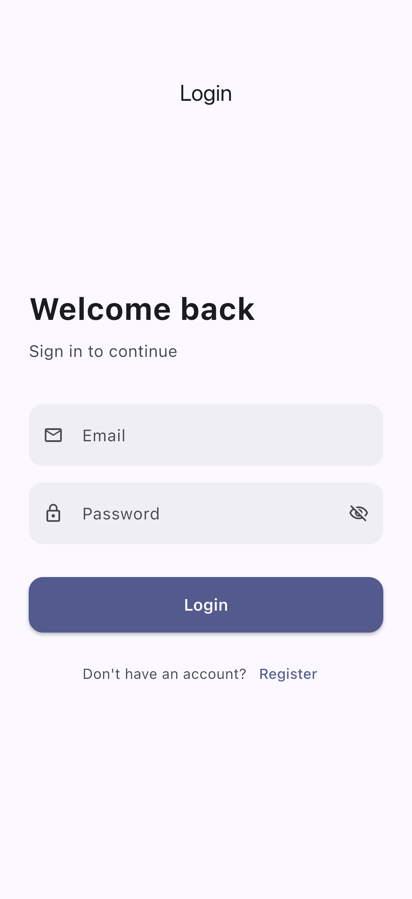
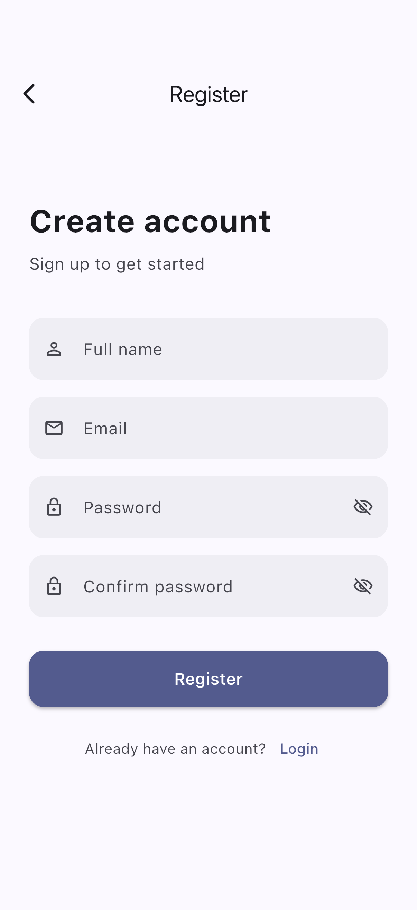
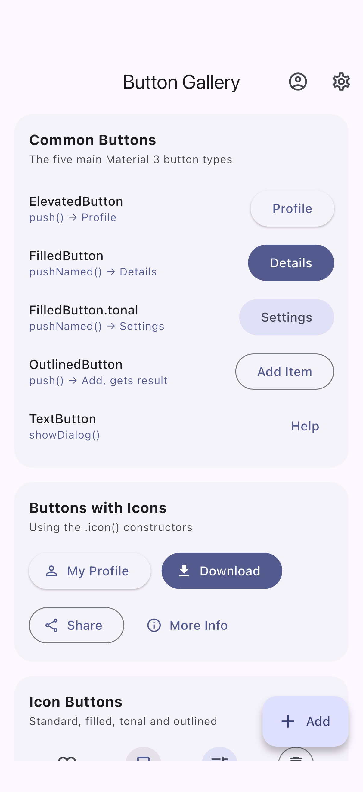
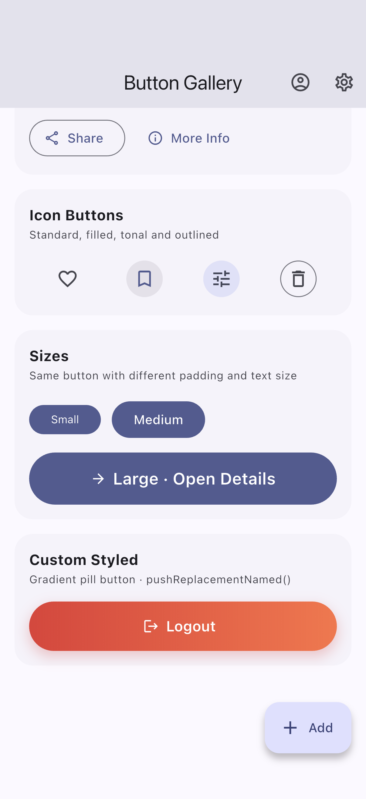
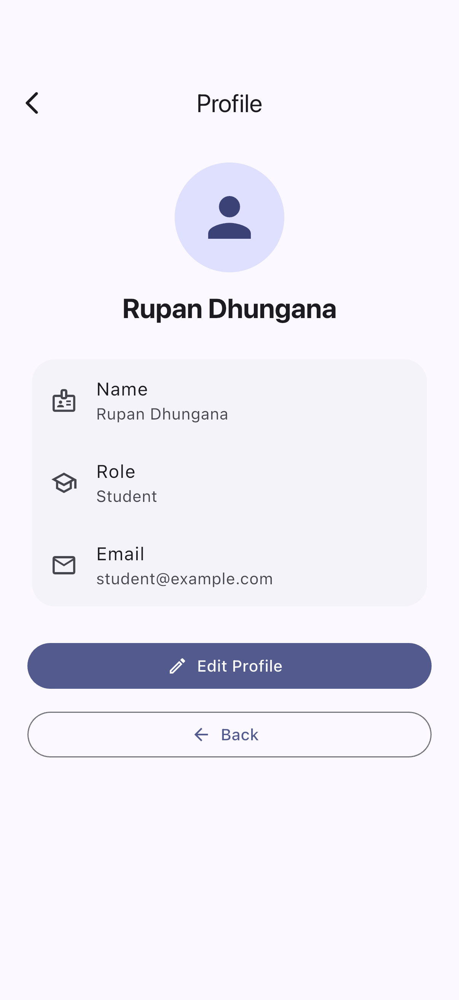
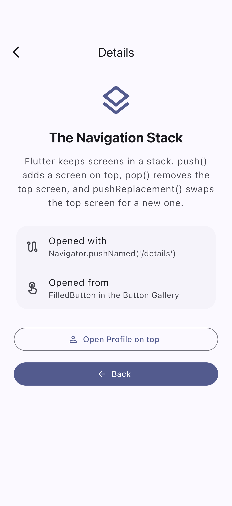
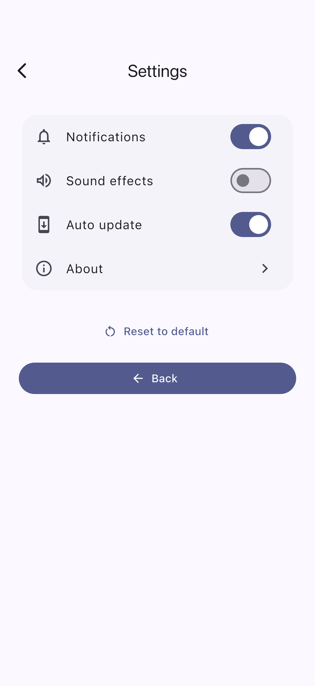
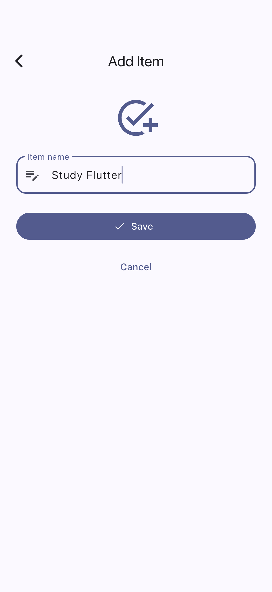
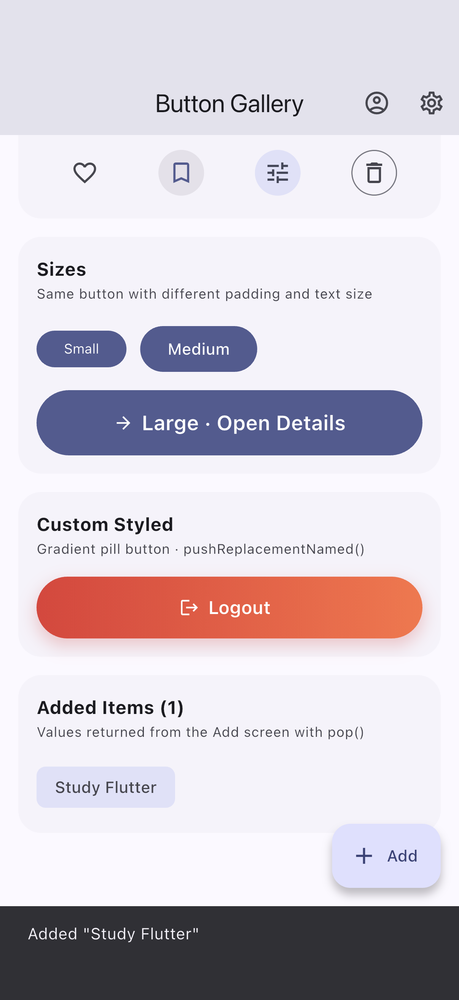

# Flutter Buttons & Navigation

A small multi-screen Flutter app that demonstrates **Material 3 button variants** and the main **Navigator** techniques: `push()`, `pop()`, `pushReplacement()` and **named routes**.

## Screenshots

| Login | Register | Button Gallery |
|:---:|:---:|:---:|
|  |  |  |

| Gallery (scrolled) | Profile | Details |
|:---:|:---:|:---:|
|  |  |  |

| Settings | Add Item | Item returned with `pop()` |
|:---:|:---:|:---:|
|  |  |  |

## Features

### Button Gallery

Buttons are grouped into sections. Each one does something real.

| Section | Widget | Action |
|---|---|---|
| Common Buttons | `ElevatedButton` | Opens **Profile** with `Navigator.push()` |
| | `FilledButton` | Opens **Details** with `Navigator.pushNamed()` and passes `arguments` |
| | `FilledButton.tonal` | Opens **Settings** with `Navigator.pushNamed()` |
| | `OutlinedButton` | Opens **Add Item** with `Navigator.push()` and waits for a result |
| | `TextButton` | Shows a help dialog |
| Buttons with Icons | `ElevatedButton.icon` | Opens **Profile** (named route) |
| | `FilledButton.icon` | Download message |
| | `OutlinedButton.icon` | Share message |
| | `TextButton.icon` | Opens **Details** (named route) |
| Icon Buttons | `IconButton` | Toggles favorite |
| | `IconButton.filled` | Toggles bookmark |
| | `IconButton.filledTonal` | Opens **Settings** |
| | `IconButton.outlined` | Clears added items |
| Sizes | `FilledButton` | Small, medium and large (full-width) versions |
| Custom Styled | `GradientButton` (custom) | **Logout** with `pushReplacementNamed()` |
| — | `FloatingActionButton.extended` | Opens **Add Item** |
| AppBar | `IconButton` × 2 | Profile and Settings shortcuts |

### Screens

| Screen | File | What it shows |
|---|---|---|
| Login | `lib/screens/login_screen.dart` | Validated email/password form |
| Register | `lib/screens/register_screen.dart` | Sign-up form, returns to Login with `pop()` |
| Button Gallery | `lib/screens/button_gallery_screen.dart` | All button variants |
| Profile | `lib/screens/profile_screen.dart` | Avatar, name, role, email, **Edit Profile** and **Back** |
| Details | `lib/screens/details_screen.dart` | Explains the navigation stack and reads route `arguments` |
| Settings | `lib/screens/settings_screen.dart` | Switches, About dialog, **Back** |
| Add Item | `lib/screens/add_screen.dart` | Sends the new item back with `pop(context, value)` |

## Navigation Methods

| Method | Where it is used |
|---|---|
| `Navigator.push()` | Gallery → Profile, Gallery → Add Item |
| `Navigator.pop()` | Back buttons on Profile, Details, Settings, Register; closing dialogs |
| `Navigator.pop(context, result)` | Add Item → Gallery (returns the new item); Edit Profile dialog |
| `Navigator.pushReplacement()` | Login → Button Gallery (Back cannot return to Login) |
| `Navigator.pushReplacementNamed()` | Logout: Button Gallery → Login |
| `Navigator.pushNamed()` | Gallery → Details / Settings / Profile, Login → Register |

### Named routes (`lib/main.dart`)

```dart
MaterialApp(
  initialRoute: AppRoutes.login, // '/'
  routes: {
    '/':          (context) => const LoginScreen(),
    '/register':  (context) => const RegisterScreen(),
    '/buttons':   (context) => const ButtonGalleryScreen(),
    '/profile':   (context) => const ProfileScreen(),
    '/details':   (context) => const DetailsScreen(),
    '/settings':  (context) => const SettingsScreen(),
    '/add':       (context) => const AddScreen(),
  },
);
```

Route names are kept as constants in `lib/routes.dart`.

### Navigation flow

```
                 LOGIN ──(pushNamed)──► REGISTER
                   │                       │
     Login button: pushReplacement()     pop()
                   ▼
            BUTTON GALLERY ◄───────────────────────────┐
        /        |         \          \                │
   push()  pushNamed()  pushNamed()  push()            │
      ▼          ▼           ▼          ▼              │
   PROFILE    DETAILS    SETTINGS    ADD ITEM          │
      │          │           │          │              │
    pop()      pop()       pop()   pop(result) ────────┘

   Logout (custom button): pushReplacementNamed('/') ──► LOGIN
```

## Project Structure

```
lib/
├── main.dart                  # MaterialApp, theme, named routes
├── routes.dart                # Route name constants
├── screens/
│   ├── login_screen.dart
│   ├── register_screen.dart
│   ├── button_gallery_screen.dart
│   ├── profile_screen.dart
│   ├── details_screen.dart
│   ├── settings_screen.dart
│   └── add_screen.dart
└── widgets/
    ├── app_text_field.dart    # Reusable text field, button and validators
    └── section_card.dart      # Section card, demo row and GradientButton
test/widget_test.dart          # Navigation tests
integration_test/              # Walks through the app and takes screenshots
```

## Running the App

```bash
flutter pub get
flutter run
```

Log in with any email containing `@` and a password of at least 6 characters.

### Tests

```bash
flutter test
```

The widget tests check that:
- Login shows errors for empty fields.
- Login uses `pushReplacement()`, so there is no screen to go back to.
- `push()` opens Profile and `pop()` returns to the gallery.
- A named route opens Details with its arguments.
- The Add screen returns its value with `pop()`.
- Logout replaces the gallery with Login.

### Regenerating the screenshots

With a simulator or device running:

```bash
flutter drive --driver=test_driver/integration_test.dart \
  --target=integration_test/screenshots_test.dart
```

Images are saved to `screenshots/`.

## Built With

- Flutter 3.44 / Dart 3.12
- Material 3 (`ColorScheme.fromSeed`)
